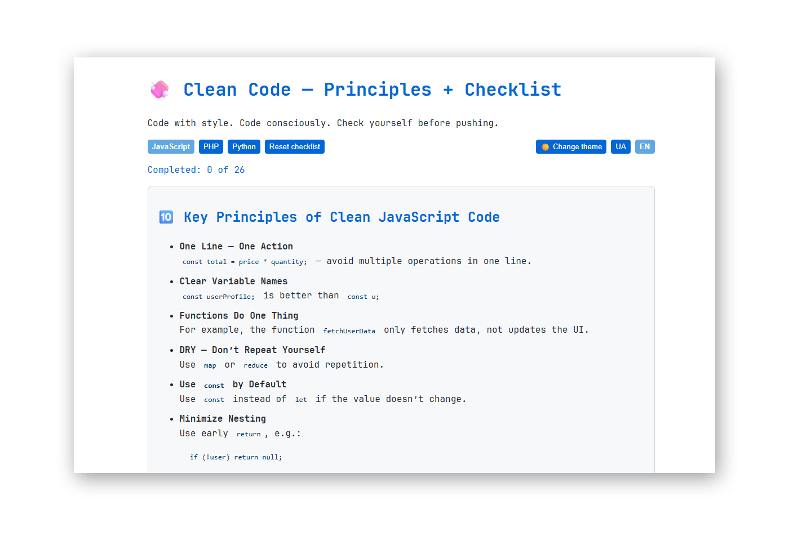
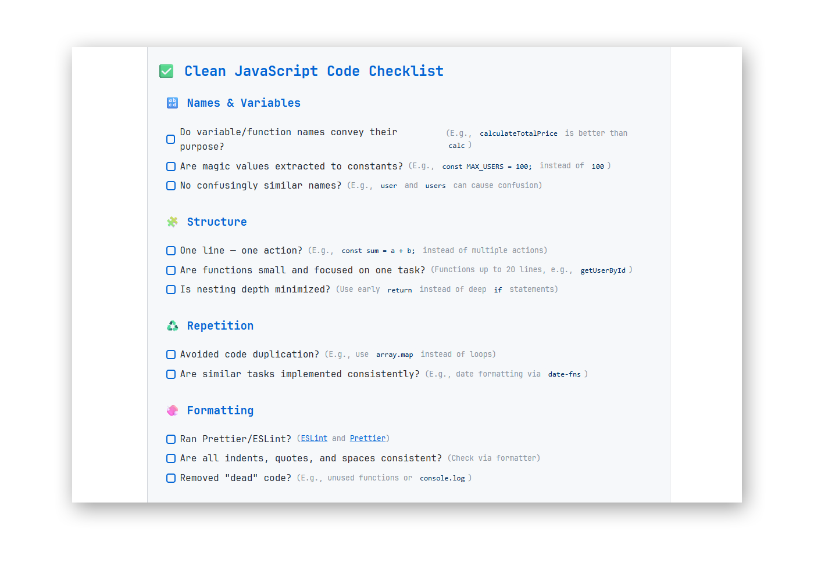

# Clean Code — Principles + Checklist

An interactive checklist for maintaining clean JS, PHP, and Python code: helps avoid errors, repetition, and unnecessary chaos before push.

[!img]()
 
[!img]()

 [Go to the checklist](https://ovcharovcoder.github.io/clean-code-checklist)
